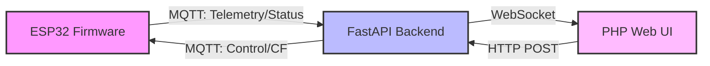
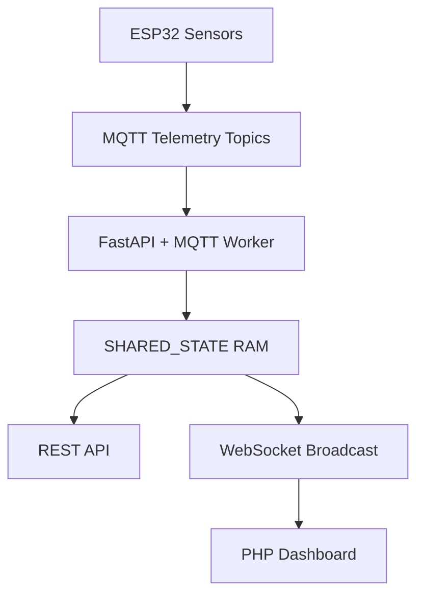

# LAB PSU Controller & Monitor Hub

An integrated real-time telemetry monitor and actuator control system for Laboratory Power Supply Units (PSU). This project combines an ESP32 microcontroller, MQTT messaging, a FastAPI backend, and a responsive PHP web dashboard to provide real-time monitoring and control of PSU hardware.

---

## ⚡ System Architecture

The system utilizes an **in-memory RAM architecture** to handle rapid telemetry streams without introducing disk I/O bottlenecks.



### Components

#### Firmware (ESP32)

* Reads PSU rail voltages through ADC.
* Collects environmental data from BMP280 and AHT20 sensors.
* Displays live information on a 0.96" SH1106 OLED.
* Publishes telemetry via MQTT.
* Receives actuator control commands through MQTT.

#### Backend (FastAPI + MQTT)

* FastAPI web server.
* Paho-MQTT client running in a background worker thread.
* Shared in-memory state storage using a global `SHARED_STATE` dictionary.
* Real-time WebSocket broadcasting.

#### Web Dashboard (PHP)

* Dark-neon themed monitoring interface.
* Real-time updates via WebSocket.
* Hardware control through REST APIs.
* Telemetry calibration interface.

---

## 🛠️ Project Structure

```text
.
├── backend/
│   ├── requirements.txt
│   ├── config.py
│   ├── devices.py
│   ├── sender.py
│   ├── listener.py
│   └── main.py
│
├── firmware/
│   └── esp32_firmware.ino
│
├── web/
│   └── index.php
│
└── .env.example
```

### File Overview

| File                  | Description                                  |
| --------------------- | -------------------------------------------- |
| `backend/config.py`   | Environment variable parser                  |
| `backend/devices.py`  | Hardware device token mappings               |
| `backend/sender.py`   | MQTT command publisher and debugging utility |
| `backend/listener.py` | MQTT listener                                |
| `backend/main.py`     | FastAPI application                          |
| `firmware/script.ino` | ESP32 firmware source                        |
| `web/index.php`       | Dashboard UI                                 |

---

## 🚀 Getting Started

### 1. Prerequisites

#### Hardware

* ESP32
* SH1106 0.96" OLED Display (I2C)
* BMP280
* AHT20
* Relay Modules

#### Software

* Python 3.10+
* PHP 8.x+
* MQTT Broker (Mosquitto recommended)

---

### 2. Configuration

Create a `.env` file based on `.env.example`.

```env
MQTT_BROKER=your_broker_ip
MQTT_PORT=1883

TOPIC_TELEMETRY=lab/psu/1/telemetry
TOPIC_STATUS=lab/psu/1/status
TOPIC_CONTROL_PREFIX=lab/control/1/

LOCAL_API_URL=http://localhost:8081
LOCAL_WS_URL=ws://localhost:8081

PROD_API_URL=https://api.yourdomain.com
PROD_WS_URL=wss://api.yourdomain.com
```

---

### 3. Backend Setup

Navigate to the backend directory:

```bash
cd backend
```

Install dependencies:

```bash
pip install -r requirements.txt
```

Run the server:

```bash
uvicorn main:app --host 0.0.0.0 --port 8081 --reload
```

---

### 4. Firmware Installation

1. Open `firmware/script.ino` in Arduino IDE.

2. Install required libraries:

   * PubSubClient
   * U8g2
   * Adafruit BMP280
   * Adafruit AHTX0
   * ArduinoJson

   ArduinoOTA.setHostname("ESP32_Lab_PSU_1"); // The name that will appear in the Arduino IDE
  ArduinoOTA.setPassword("password");     // Optional: Give a password so that not just anyone can flash it.
  

3. Configure:

```cpp
const char* ssid = "your-wifi";
const char* password = "your-password";
const char* mqtt_server = "broker-ip";

// Optional
ArduinoOTA.setHostname("ESP32_Lab_PSU_1"); // The name that will appear in the Arduino IDE
ArduinoOTA.setPassword("password");     // Optional: Give a password so that not just anyone can flash it.
```

4. Upload firmware to ESP32.
5. Optional: Enable ArduinoOTA for wireless updates.

---

### 5. Web Interface Deployment

Deploy the `web/` directory through:

* Nginx + PHP-FPM
* Apache + PHP
* Any PHP-compatible hosting environment

Ensure the application can access the shared `.env` file:

```php
__DIR__ . '/../.env'
```

---

## 📡 API & MQTT Protocols

### HTTP API

#### Device Control

**Endpoint**

```http
POST /api/control
```

**Payload**

```json
{
  "device": "lamp",
  "state": "ON"
}
```

Supported devices:

* lamp
* led
* rack_led
* fan

---

#### Calibration

**Endpoint**

```http
POST /api/calibrate
```

**Payload**

```json
{
  "v12": 1.024,
  "v5": 0.998,
  "v5sb": 1.001
}
```

All fields are optional.

---

### WebSocket Stream

**Endpoint**

```http
GET /ws/monitor
```

#### Example Payload

```json
{
  "telemetry": {
    "12v": 12.04,
    "5v": 5.01,
    "5vsb": 4.98,
    "pg": 1,
    "env": {
      "temp": 27.5,
      "hum": 62,
      "pres": 1011.2
    }
  },
  "status": {
    "lamp": "OFF",
    "led": "ON",
    "rack_led": "OFF",
    "fan": "OFF"
  },
  "cf": {
    "v12": 1.0000,
    "v5": 1.0000,
    "v5sb": 1.0000
  }
}
```

---

## 📊 Telemetry Flow



---

## 🛡️ Key Features

### Zero-Disk Architecture

* No `state.json`
* No file-based caching
* All runtime data stored directly in RAM
* Reduced latency and increased responsiveness

### Real-Time Dashboard

* Live telemetry updates
* Instant actuator feedback
* No page refresh required

### Safe Calibration Input

Dashboard calibration fields use:

```javascript
document.activeElement
```

to prevent incoming WebSocket updates from overwriting user input while editing values.

### Concurrent Processing

* MQTT listener runs independently.
* FastAPI serves HTTP and WebSocket requests simultaneously.
* Shared memory architecture avoids expensive synchronization layers.

---

## 🔧 Future Improvements

* Authentication & authorization.
* Multi-device support.
* Historical telemetry storage (InfluxDB / PostgreSQL).
* Grafana integration.
* OTA firmware management.
* Alert & notification system.
* PSU fault diagnostics and protection analytics.

---

## 📜 License

MIT License

Copyright (c) 2026 Averyandra
